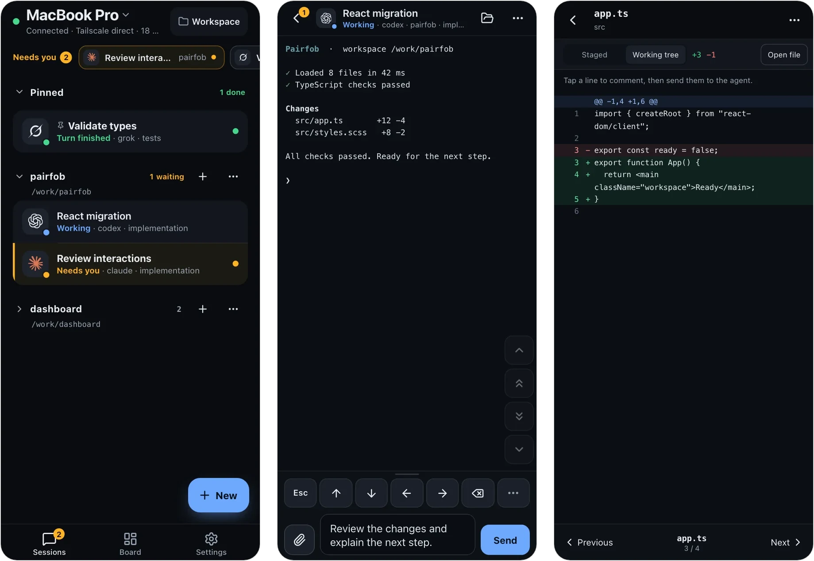

# Pairfob

[](LICENSE)
[](https://pairfob.com)
[](https://pairfob.com/doc/)

**English** | [简体中文](README_zh.md)

**Continue your [Herdr](https://herdr.dev) sessions from your phone.** Agents
keep running on the computer. Pairfob lets a paired phone read their live panes
and send keys back over Tailscale.



## Quick start from this checkout

The published installer still serves the older relay version. To use the
Tailscale direct version on `main`, build it from source for now. You need
macOS or Linux, Go 1.26, bun, Herdr 0.7+, and Tailscale connected on both the
computer and phone. The phone must be allowed to reach the computer's Tailscale
IP on TCP port 18474.

```sh
(cd pwa && bun install --frozen-lockfile)
bash ./scripts/embed-pwa.sh
mkdir -p "$HOME/.local/bin"
go build -o "$HOME/.local/bin/pairfob" ./cmd/pairfob
"$HOME/.local/bin/pairfob" service install
"$HOME/.local/bin/pairfob" doctor
"$HOME/.local/bin/pairfob" pair
```

Scan the QR with the phone's system camera, or open the complete pairing link
printed below it. The short code alone cannot connect. Approve the pairing by
pressing Enter on the computer. Later, reopen that computer's Tailscale address
in the same phone browser. Keep the built binary in place: the user service
starts that file at login. See [Tailscale direct deployment](docs/tailscale-direct.md)
for service management, device cleanup, and browser limits.

The [Herdr plugin](plugin/herdr/README.md) and the hosted installer currently
install the older release. They need a new published binary for direct mode.

## What you can do from the phone

- **Respond when an agent needs you.** A **Needs you** strip surfaces waiting
  agents when you open Pairfob; tap one to reach its prompt.
- **Work in the live session.** Read the rendered pane, type with the system
  keyboard, and use the key pad. You can also switch to Terminal for full-screen
  TUIs or Chat for an easier-to-read agent conversation.
- **Review changes.** Browse files, read git status and diffs, comment on diff
  lines and send the comments to the agent.
- **Shape the workspace.** Start conversations, tabs, splits and worktrees, and
  see a tab's real pane layout on the **Board**. Controls only appear when the
  computer supports them.
- **Several computers, several devices.** One phone can switch between
  computers; each computer can have several paired devices.
- **Keep an eye on quota.** Subscription allowance for Codex, Claude Code,
  Copilot, Cursor, Grok and more, collected on the computer.

The phone UI speaks English and 中文. On this direct HTTP address, browser push
and attachment upload are unavailable. Browser camera scanning and PWA
installation may also be blocked; use the phone's system camera for the QR.

## Security

- **Pairing** uses SPAKE2+ with a code both sides confirm; session keys are
  hardened with Argon2id.
- **Keys** live only on the computer and the paired device.
- **Private network.** Phone and computer communicate through your Tailscale
  tailnet; there is no Pairfob relay or WebRTC fallback.
- **Herdr stays local.** Pairfob connects to Herdr through its local socket;
  the phone reaches only the Pairfob listener on the tailnet.

See [privacy and browser limits](docs/tailscale-direct.md#privacy-and-browser-limits) and report
vulnerabilities privately via [SECURITY.md](SECURITY.md).

## Requirements

| | |
| --- | --- |
| Computer | macOS or Linux (Windows is not supported) |
| Herdr | 0.7 or newer; the installer can install pinned 0.8.2 |
| Herdr plugin | Herdr 0.8.2 or newer |
| Close a workspace from the phone | Herdr 0.9.0 or newer |
| Phone / tablet | A current mobile browser and Tailscale on the same tailnet |
| Build tools for this checkout | Go 1.26 and bun |

## Computer commands

These examples assume `~/.local/bin` is in your `PATH`; otherwise use
`"$HOME/.local/bin/pairfob"`.

```sh
pairfob                     # status; starts the daemon if it is not running
pairfob pair                # pair a phone, tablet, or another computer
pairfob list                # paired devices
pairfob forget 1            # unpair by index or name
pairfob doctor              # diagnose this computer (never changes anything)
pairfob setup               # check, optionally install, and start Herdr
pairfob update              # released binaries only; rebuild this checkout to update it
pairfob quota-setup-claude  # enable Claude subscription quota collection
pairfob service status      # login service: start / stop / restart / install / uninstall
```

A second computer builds and runs its own user service; pair it from the phone with
**Settings → Add another computer**. See [service and device management](docs/tailscale-direct.md)
for direct deployments.

## How it works

```
phone --Tailscale HTTP/WS--> pairfob daemon --loopback--> Herdr
```

The phone reads the rendered pane and sends keys back to the PTY; it is not a
terminal emulator of its own. Protocol specs live in [`proto/`](proto/), including
[mux control plane](proto/envelope-v2.md).

| Path | What it is |
| --- | --- |
| `cmd/pairfob` | the computer daemon and CLI |
| `internal/` | pairing, sessions, RPC, Herdr adapter, protocol primitives |
| `pwa/` | the phone app (React + TypeScript, built with bun) |
| `internal/tailnet` | daemon-hosted PWA and direct WebSocket gateway on the Tailscale IPv4 address |
| `site/` | homepage and [documentation](https://pairfob.com/doc/) sources |
| `proto/` | frozen envelope, RPC schema and test vectors |
| `plugin/herdr` | Herdr plugin entrypoints |

## Develop

```sh
(cd pwa && bun install --frozen-lockfile)
./scripts/verify.sh     # full gate: Go, PWA, Worker, site tests and builds
```

`scripts/dev-up.sh` is a local Worker origin test harness for protocol work;
the direct host build is shown above. Real-phone testing, verification scope,
protocol invariants and releases:
[`docs/develop.md`](docs/develop.md).

## Contributing

Issues and pull requests are welcome at
[github.com/arronKler/pairfob](https://github.com/arronKler/pairfob). Run the
checks that match your change (see [`docs/develop.md`](docs/develop.md#verification))
and list them in the PR. The envelope, vectors and RPC fields under `proto/`
are frozen by design; please open an issue before proposing a change there.

## License

[Apache License 2.0](LICENSE). See [NOTICE](NOTICE).
