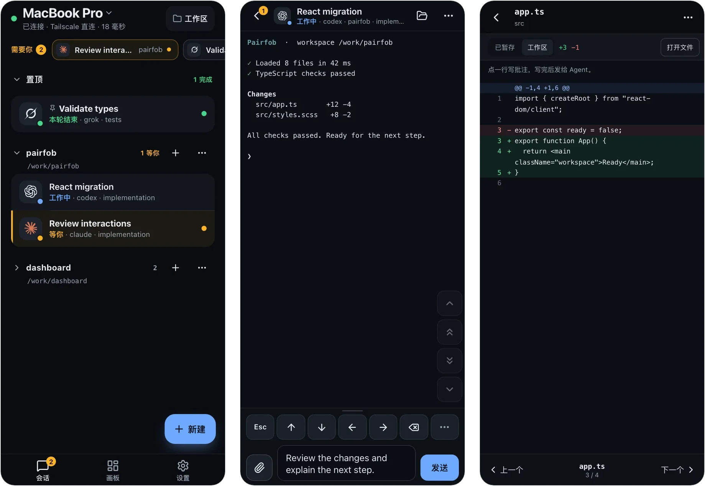

# Pairfob

[](LICENSE)
[](https://pairfob.com)
[](https://pairfob.com/doc/zh/)

[English](README.md) | **简体中文**

**把 [Herdr](https://herdr.dev) 里的 Agent 带到手机上。** Codex、Claude、Grok
等 Agent 继续在你的电脑上跑；配对一次后，手机、平板或另一台电脑打开的是
**同一批活着的会话**，不是副本。手机和电脑通过同一个 Tailscale 网络
直连，会话内容端到端加密。



## 快速开始

macOS 或 Linux，电脑上装有 Herdr（没装时安装脚本会询问是否帮你装）。

```sh
curl -fsSL https://pairfob.com/install.sh | sh
pairfob pair
```

先让手机和电脑加入同一个 Tailscale 网络。运行 `pairfob pair`，用手机扫描终端里的
二维码（也可以粘贴二维码下方的完整配对链接），然后在电脑上按一次回车放行。
浏览器若允许从该 HTTP 地址安装，可以加到主屏幕。完整步骤见
[Tailscale 直连部署说明](docs/tailscale-direct.md)。

平时就在 Herdr 里？`herdr plugin install arronKler/pairfob` 会把
**Pairfob: Pair a device** 加进 Herdr 的动作菜单，首次使用时安装同一个经过
校验的二进制。见 [`plugin/herdr/`](plugin/herdr/README.md)。

## 在手机上能做什么

- **Agent 等你时及时处理。** 列表顶部的 **需要你** 和可选的推送通知会把
  等待中的 Agent 提出来，点一下直接进到那个提示。
- **在活着的会话里干活。** **自动** 会按会话在三种模式间选择：**控制**
  （终端画面 + 系统键盘，支持听写，带快捷键区）、**终端**（真实 PTY，适合
  vim 和全屏 TUI）、**对话**（给 Agent 发消息、看回复）。
- **审查改动。** 浏览文件，查看 git 状态和 diff，在 diff 行上写评论并发给
  Agent。
- **把文件交给 Agent。** 通过加密会话上传照片、PDF 等文件，把工作区路径插入草稿。
- **管理工作区。** 新建对话、标签页、分屏和 worktree，在 **画板** 上看标签页
  的真实分栏。电脑不支持的操作不会出现。
- **多台电脑、多台设备。** 一台手机可以在几台电脑之间切换，一台电脑也可以
  配对多台设备。
- **看订阅余量。** 由电脑收集 Codex、Claude Code、Copilot、Cursor、Grok 等账号的
  额度。

手机端支持中文和 English。

## 安全

- **配对** 用 SPAKE2+，配对码由双方确认；会话密钥用 Argon2id 加固。
- **密钥** 只在电脑和已配对设备上。
- **私有网络。** 手机通过 Tailscale IP 直接连接电脑，不经过 Pairfob 中继。
- **Herdr 不对外开放。** Pairfob 只在电脑的 Tailscale IP 上监听，Herdr 仍在本机。

直连的隐私与浏览器限制见 [部署说明](docs/tailscale-direct.md#privacy-and-browser-limits)。安全漏洞请按
[SECURITY.md](SECURITY.md) 私下报告。

## 环境要求

| | |
| --- | --- |
| 电脑 | macOS 或 Linux（不支持 Windows） |
| Herdr | 0.7 及以上；安装脚本可以装固定版本 0.8.2 |
| Herdr 插件 | Herdr 0.8.2 及以上 |
| 在手机上关闭工作区 | Herdr 0.9.0 及以上 |
| 手机 / 平板 | 较新的移动浏览器，可安装为 PWA |

## 电脑上的命令

```sh
pairfob                     # 查看状态；没在运行时启动它
pairfob pair                # 配对手机、平板或另一台电脑
pairfob list                # 已配对设备
pairfob forget 1            # 按序号或名字解除配对
pairfob doctor              # 检查这台电脑（只诊断，不改任何东西）
pairfob setup               # 检查 Herdr，按需安装并启动
pairfob update              # 更新到最新版本并重启服务
pairfob quota-setup-claude  # 开启 Claude 订阅余量采集
pairfob service status      # 登录服务：start / stop / restart / install / uninstall
```

第二台电脑运行同一个安装脚本，然后在手机上用 **设置 → 添加另一台电脑**
配对。服务和设备管理见 [部署说明](docs/tailscale-direct.md)。

## 工作原理

```
手机 --Tailscale HTTP/WS--> Pairfob daemon --本机连接--> Herdr
```

手机读取渲染好的终端画面，把按键发回 PTY；它本身不是终端模拟器。
协议规格在 [`proto/`](proto/)，包括 [mux 控制层](proto/envelope-v2.md)。

| 目录 | 内容 |
| --- | --- |
| `cmd/pairfob` | 电脑端 daemon 和命令行 |
| `internal/` | 配对、会话、RPC、Herdr 适配、协议原语 |
| `pwa/` | 手机端应用（React + TypeScript，用 bun 构建） |
| `internal/tailnet` | Tailscale IP 上的网页和 WebSocket 网关 |
| `site/` | 主页和[文档](https://pairfob.com/doc/zh/)源码 |
| `proto/` | 冻结的信封格式、RPC schema 和测试向量 |
| `plugin/herdr` | Herdr 插件入口 |

## 开发

```sh
(cd pwa && bun install --frozen-lockfile)
./scripts/dev-up.sh     # 在本机回环地址启动 origin + pairfob + PWA
./scripts/verify.sh     # 完整检查：Go、PWA、Worker、站点测试和构建
./scripts/dev-down.sh
```

设置 `PAIRFOB_DEV_FAKE_RUNTIME=1` 可以不接 Herdr、用演示数据。真机调试、
验证范围、协议约束和发布流程见 [`docs/develop.md`](docs/develop.md)（英文）。

## 参与贡献

欢迎在 [github.com/arronKler/pairfob](https://github.com/arronKler/pairfob)
提 issue 和 PR。按改动范围运行对应检查（见
[`docs/develop.md`](docs/develop.md#verification)），并在 PR 里写明跑了哪些。
`proto/` 下的信封格式、测试向量和 RPC 字段是有意冻结的，想改动请先开 issue 讨论。

## 许可证

[Apache License 2.0](LICENSE)。见 [NOTICE](NOTICE)。
